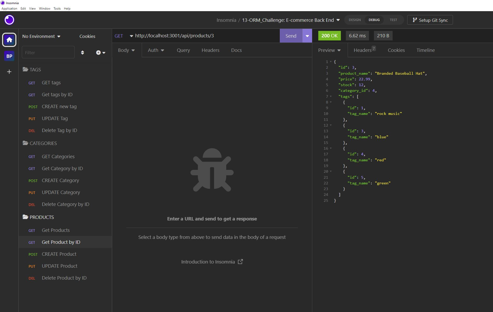

# 13-ORM-Ecommerce_Back_End

## Description

    It is an employee tracker that allows user to add, update, and view employees. 
    Category for each employees are their name, title, department, salary, and manager.

    Entering your employee's information and this tracker will generate a database using
    provided information.      

## Table of Contents (Optional)

- [Installation](#installation)
- [Usage](#usage)
- [License](#license)
- [Contributing](#contributing)
- [Tests](#tests)
- [Questions](#questions)

## Installation

To install necessary dependencies, run the following command: 

    npm i  

## Usage

Here is the [Demonstration video](https://drive.google.com/file/d/1fB5f8p_esXW1X0kt0rkwiPkTqhVjifg4/view)

Step1: run following command in your terminal:

    node index.js

step 2: type in your information to the prompt

example:

## License

N/A

## How to Contribute

N/A

## Tests

N/A
